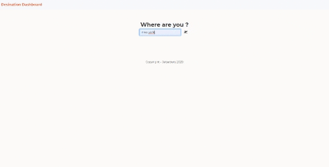

# Destination Dashboard

Created a travel lifestyle application that allows the user to input destination upon arrival and be presented with all the basic information/travel tips, popular attractions and restaurants in the area so that they can enjoy my stay as soon as they land. This app will run in the browser and feature dynamically updated HTML and CSS powered by jQuery.


## User Story

```
AS A constant traveler with a busy schedule
I WANT to add search palces to eat and visit 
SO THAT I can manage my time effectively and be
ready prior arrival

```


## Acceptance Criteria

```
GIVEN I am travelling to a new city
WHEN I input my travel preferences into the search field
THEN I am presented with options that are catered to the things I am searching for
GIVEN I am looking for new information on a city I am visiting
WHEN I use my location
THEN I am presented with options that are in the nearby vicinity
GIVEN I find an interesting location I intend on visiting
WHEN I begin building my itinerary for my stay
THEN I am presented with a prebuilt itinerary

```


The following animation demonstrates the application functionality:



## Deployed Application

* The URL of the deployed application : [click here](https://adilh621.github.io/Destination-Dashboard/dashboard.html)


- - -
© 2020 Trilogy Education Services, a 2U, Inc. brand. All Rights Reserved.